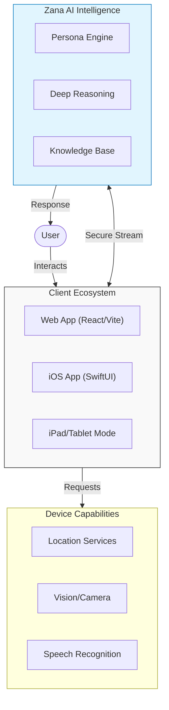
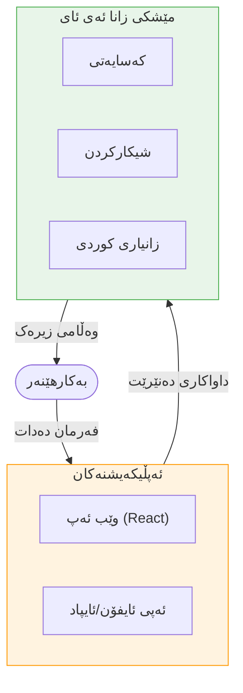

<div align="center">
  
  <h1>ZanaAI</h1>
  
  <p>
    <a href="#-english"><strong>English</strong></a> | <a href="#-kurdish"><strong>کوردی</strong></a>
  </p>

  <p>
    <strong>The Next-Generation AI Assistant | زیرەکی دەستکردی نەوەی نوێ</strong>
  </p>
  
  [](https://react.dev/)
  [](https://developer.apple.com/xcode/swiftui/)
  [](flkrdstudio.netlify.app)
  [](https://flkrdstudio.netlify.app)
  [](https://flkrdstudio.netlify.app)
</div>

<div align="center">
  <h3>
    <a href="#-architecture">Architecture</a> •
    <a href="#-features">Features</a> •
    <a href="#-installation">Installation</a> •
    <a href="#-kurdish">Switch to Kurdish</a>
  </h3>
</div>

---

<div id="english"></div>

# 🌍 English

## 🚀 Overview
**ZanaAI** is a groundbreaking artificial intelligence assistant developed in Kurdistan, designed to provide a seamless, hyper-intelligent experience across web and mobile platforms. Built by **FLKRDSTUDIO**, ZanaAI features its own proprietary persona and adaptation layer, delivering accurate, culturally aware, and multimodal responses.

> [!IMPORTANT]
> **ZanaAI Reference Architecture**: This repository contains the source code for the ZanaAI client ecosystem, specifically tailored for high-performance interaction on iOS and Web.

## 🏗 Architecture
See how ZanaAI connects user interfaces with deep intelligence:



## 📂 Project Structure
```text
zana-ai/
├── 📱 ZanaAI-iOS/          # Native Swift Application
│   ├── ZanaAI/             # Main App target
│   ├── ZanaWidget/         # Home Screen Widgets
│   └── ZanaAITests/        # Unit & UI Tests
├── 🌐 src/                 # Web Application Sources
│   ├── components/         # React Components (UI)
│   ├── services/           # AI & API Services
│   └── lib/                # Utilities & Helpers
├── 🎨 public/              # Static Assets & Icons
└── ⚙️ package.json         # Web Dependencies
```

## ✨ Key Features
| Feature | Description |
| :--- | :--- |
| **🧠 Zana Intelligence** | Custom-tuned model for coding, reasoning, and creative writing. |
| **🎨 Glassmorphic UI** | Premium, translucent design system using **Framer Motion** & **SwiftUI**. |
| **📱 Cross-Platform** | Seamless sync between **Web** (React 19) and **iOS** (iPhone/iPad). |
| **📝 Rich Content** | Full **Markdown** & **LaTeX** support for scientific data. |
| **📍 Smart Sense** | Integration with **Location**, **Camera**, and **Voice** APIs. |

<div id="installation"></div>

## 🏁 Getting Started

<details>
<summary><h3>🌐 Web Development Setup (Click to Expand)</h3></summary>

1. **Clone the repository**
   ```bash
   git clone https://github.com/flkrdstudio/zana-ai.git
   cd zana-ai
   ```

2. **Install dependencies**
   ```bash
   npm install
   ```

3. **Configure Environment**
   Create a `.env.local` file:
   ```env
   VITE_API_KEY=your_key_here
   ```

4. **Run the Server**
   ```bash
   npm run dev
   ```

> [!TIP]
> The web app runs on `localhost:5173` by default.
</details>

<details>
<summary><h3>🍎 iOS Development Setup (Click to Expand)</h3></summary>

1. **Open Xcode Project**
   Navigate to `ZanaAI-iOS/` and open `ZanaAI.xcodeproj`.

2. **Select Target**
   Choose a Simulator (e.g., **iPad Pro (M4)**) or a real device.

3. **Build & Run**
   Press `Cmd + R`.

> [!NOTE]
> Ensure you have **Xcode 15+** installed for full Swift 5.10+ support.
</details>

## 👨‍💻 Creator & Studio
**ZanaAI** is the vision of **Zana Farooq** from **Mergasore, Kurdistan**.
Proudly powered by **FLKRDSTUDIO**.

---

<div id="kurdish"></div>
<div dir="rtl">

# 🇹🇯 کوردی

## 🚀 پوختە
**ZanaAI** (زانا ئەی ئای) یەکەمین یاریدەدەری زیرەکی دەستکردی ئاست-بەرزە لە کوردستان، کە لەلایەن **FLKRDSTUDIO** پەرەی پێدراوە. خاوەنی کەسایەتی سەربەخۆ و توانای شیکارکردنی وردە بە زمانی کوردی (سۆرانی) و زمانی ئینگلیزی.

> [!IMPORTANT]
> **ژیریی تایبەت**: زانا ئەی ئای تەنها وەرگێڕ نییە؛ سیستەمێکە توانای بیرکردنەوە و شیکارکردنی هەیە بە گوێرەی کولتوور و زمانی کوردی.

## 🏗 نەخشەی سیستەم (Architecture)



## ✨ تایبەتمەندییە سەرەکییەکان
| تایبەتمەندی | وەسف |
| :--- | :--- |
| **🧠 ژیریی زانا** | مۆدێلی تایبەت بۆ کۆدین، نووسین، و شیکارکردن. |
| **🎨 دیزاینی شووشەیی** | دیزاینێکی مۆدێرن و سەرنجڕاکێش بە **SwiftUI**. |
| **📱 هەموو ئامێرێک** | کاردەکات لەسەر وێب، ئایفۆن، و ئایپاد پرۆ. |
| **📝 زانست و داتا** | پشتیوانی تەواو بۆ هاوکێشەی بیرکاری (**LaTeX**) و خشتە. |
| **📍 هەستەوەری زیرەک** | بەکارهێنانی جی پی ئێس، کامێرا، و دەنگ. |

## 🏁 دەستپێکردن

<details>
<summary><h3>🌐 دامەزراندنی وێب (لێرە داگرە)</h3></summary>

1. **داگرتنی پڕۆژە**
   ```bash
   git clone https://github.com/flkrdstudio/zana-ai.git
   ```

2. **دابەزاندنی پێداویستییەکان**
   ```bash
   npm install
   ```

3. **کارپێکردن**
   ```bash
   npm run dev
   ```
</details>

<details>
<summary><h3>🍎 دامەزراندنی iOS (لێرە داگرە)</h3></summary>

1. **کردنەوەی پڕۆژە**
   فایلی `ZanaAI.xcodeproj` لە ڕێگەی **Xcode** بکەرەوە.

2. **هەڵبژاردنی ئامێر**
   سیمولەیتەرێک هەڵبژێرە (وەک **iPad Pro**) یان مۆبایلەکەی خۆت.

3. **کارپێکردن**
   دوگمەی `Cmd + R` دابگرە.
</details>

## 👨‍💻 دەربارەی دروستکەر
**ZanaAI** بەرهەمی هزری **زانا فارووق**ـە، ئەندازیار و گەشەپێدەر لە **مێرگەسۆر، کوردستان**.
بە شانازییەوە لەلایەن **FLKRDSTUDIO** پەرەی پێدەدرێت.

> *"لە کوردستانەوە... بۆ جیهان."*

</div>

---

<div align="center">
  <p>Copyright © 2026 <strong>FLKRDSTUDIO</strong>. All Rights Reserved.</p>
  <p>Designed & Built with ❤️ in Kurdistan.</p>
</div>
